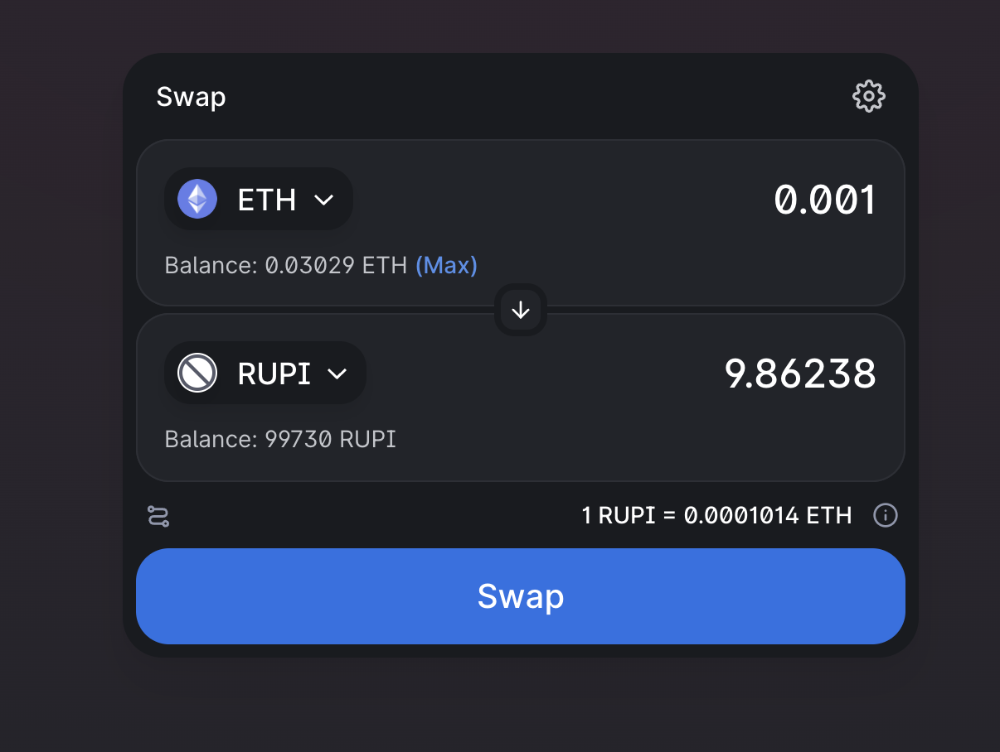

# rupi-network-token
Created a RUPI Network Token contract using Remix on Ethereum BlockChain and added liquidity for Swap on Uniswap at Kovan Testnet.

## Deploy Token on Remix

1. Compile and deploy contracts on JVM to check all is working well.
2. Copy Token.sol Solidity Code into a file in Remix rename Token.sol
3. Compile and then deploy using your metamask (If need on Kovan, Ethereum)
4. On Compiler Options dropdown select 0.8.6 version
5. Enter the parameters for deployment for (name, symbol, decimals,totalSupply)
